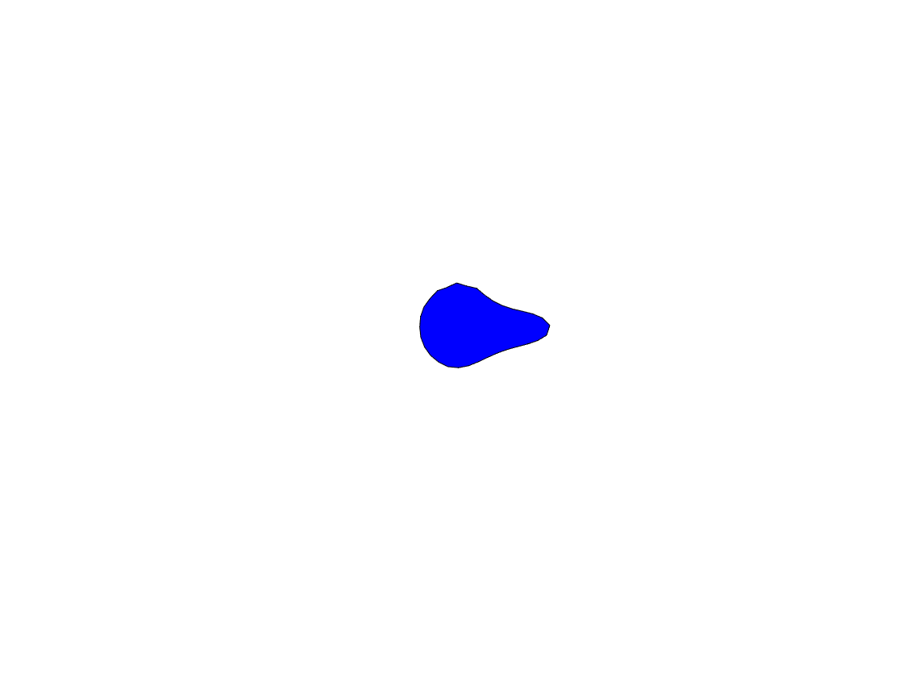

# Active Brownian Crawler model
## Written in MATLAB

By Jack Treado, Yale University, 2021


## Getting started

The main file that runs the simulation is the function `activeBrownianCrawler.m`.

<p float="left">
  
   
</p>

The code can be tuned from directed, pseudopod motion (left) to random, focal adhesion-like motion (right). 


### Inputs

The main function is defined as follows:

`function activeBrownianCrawler(NV,calA0,Kl,Kb,v0,Dr,Ds,NT,dt,NFRAMES,seed,savestr)`

* `NV`: integer number of vertices that make up the deformable particle (DP)
* `calA0`: initial **preferred** shape parameter
	* Defined as  where  and  are the preferred perimeter and area of the cell, respectively.
* `Kl`: mechanical constant for perimeter
* `Kb`: mechanical constant for curvature
* `v0`: crawling speed
* `Dr`: cell-based director diffusion coefficient
* `Ds`: "foot size", spread of velocity distribution to nearby vertices
* `NT`: number of time steps to simulate
* `dt`: time step size
	* Note that total time will be `ttotal = NT * dt`
* `NFRAMES`: total number of "frames" to be saved during simulation.
	* Frame count rounds down, i.e. if there are `NT = 8` time steps and you ask for `NFRAMES = 3`, you will only print out `2` frames total
* `seed`: integer seed for random number generator, **must be integer > 0.**
* `savestr`: string variable, path to file with saved data from simulation. Data saved in `.mat` file format, [see MATLAB documentation on MAT-files](https://www.mathworks.com/help/matlab/ref/matlab.io.matfile.html).


### Outputs

All simulation data is saved in the file named in the `savestr` variable. See [this section](#matfile-data) for a detailed list of outputs. 


## Running Locally

To run locally on your machine, call the MATLAB function from the MATLAB command line with relevant inputs. The left example was run with 
```matlab
>> activeBrownianCrawler(32, 1.3, 1.0, 0.0, 0.05, 0.01, 0.2, 1e6, 0.005, 200, 1, 'test.mat');
```
and the right-hand example with
```matlab
>> activeBrownianCrawler(32, 1.3, 1.0, 0.0, 0.05, 0.1, 0.1, 1e6, 0.005, 200, 1, 'test.mat');
```

To draw the simulation frame-by-frame, see the script `abc_draw.m`. The simulation code is replicated exactly, but the shape of the deformable particle is drawn in a figure window. An animated simulation can be `.gif` file if the `makeAMovie` variable on line `79` is set to `1`. 


## Running on the cluster 

Section in progress...


## Matfile Data

Data in the MAT-file named in the `savestr` can be either loaded into the workspace using 
```matlab
load(savestr);
```
or loaded into a `struct` using
```matlab
outputStruct = load(savestr);
```

The saved data can then be accessed as struct member variables using the `.` operator, e.g. `outputStruct.NV`. 

All inputs to the function are saved in the MAT-file with their same name. Other variables are:

* `frameList`: time step of each frame. 
	* Note: time (in simulation units) of each frame is `frameList(tt) * dt`. 
* `cList`: center-of-mass position at each frame
* `fList`: center-of-mass net force at each frame
* `vList`: center-of-mass velocity at each frame
* `UList`: shape energy at each frame
* `calAList`: shape parameter at each frame
* `abpCList`: position of active brownian particle with steps drawn from ABC ensemble
* `abpVList`: velocity of active brownian particle with steps drawn from ABC ensemble
